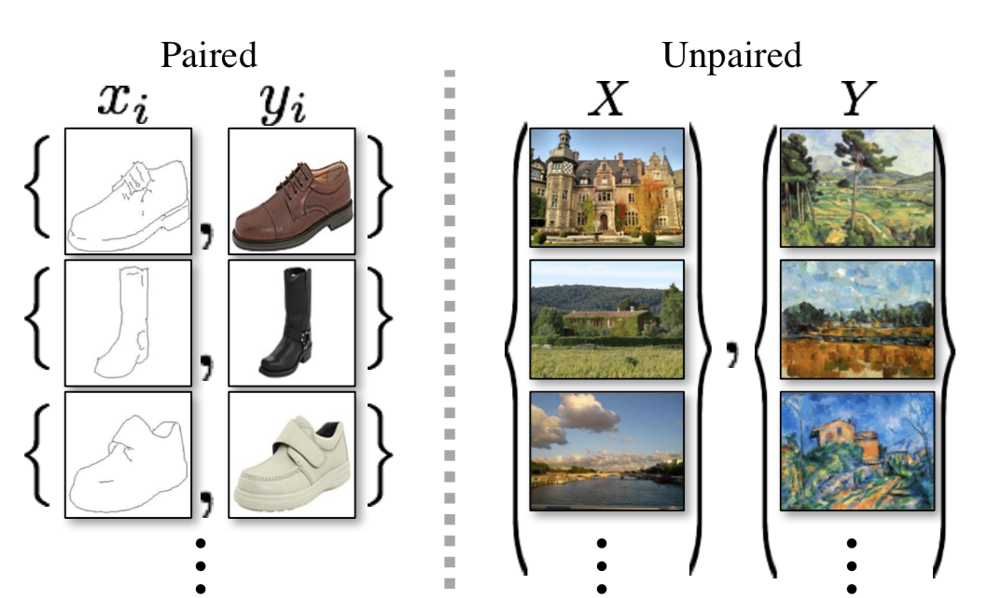
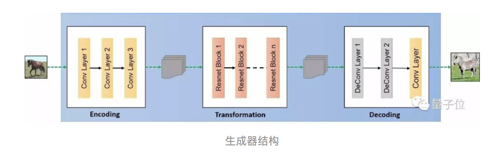
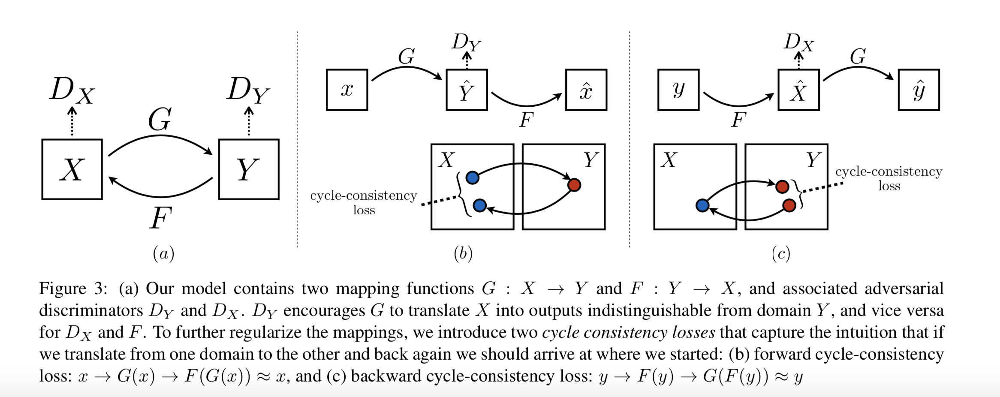
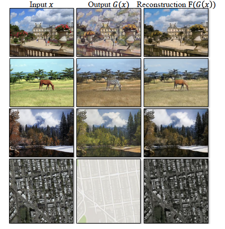
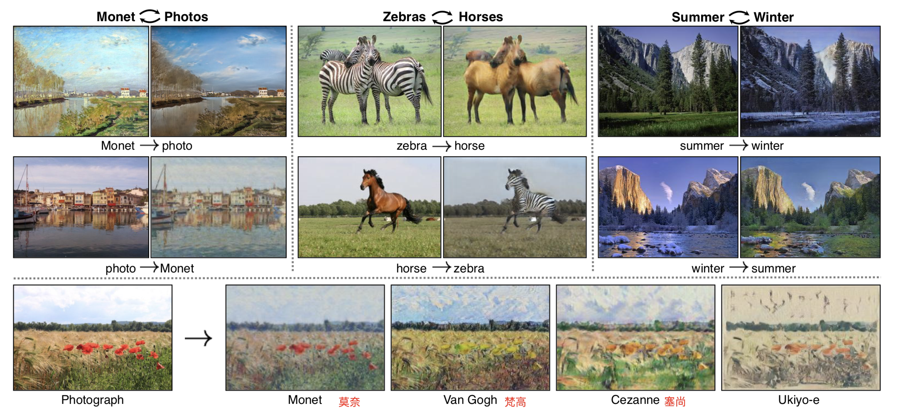

## Unpaired Image-to-Image Translation using Cycle-Consistent Adversarial Networks  

### 1.CycleGAN
能够在没有成对训练数据的情况下，将图片内容从源域迁移到目标域。CycleGAN在训练时，只需要将源域的图片和目标域的图片作为输入即可，并不要求源域跟目标域的图像内容是匹配的。  
   
假设：源域和目标域存在潜在的关系  
目标：在给定训练集   下学习源域X和目标域Y之间的映射函数。//
映射G:$X \rightarrow Y  $ 
映射F:$Y \rightarrow X  $
判别器$ D_X$ :区分图片{x}和转换的图片{F(y)}  
判别器$ D_Y$ :区分图片{y}和转换的图片{G(x)}  

 
###  2.网络结构
$(1)$生成器

《Perceptual losses for real-time style transfer and super-resolution》

* 卷积(stride=2)+残差块+反卷积(stride=$\frac{1}{2}$)
*  除了输出层之外的所有非残差卷积之后都有instance normalization和ReLU激活
*  输出层使用scaled tanh函数确保输出图像的像素在[0,255]之间

$(2)$判别器  :70x70 PatchGANs 

对图像每个大小70x70的patch做真假判别，并将一张图片的所有patch结果区平均做最终的判别器输出。

###  3.损失函数
* 对抗损失(Adversarial Loss)  

$(1) \quad G:X \rightarrow Y  \quad and \quad D_Y$  
$
\min \limits_{G}{\max \limits_{D_Y}{L_{GAN}(G,D_Y,X,Y)}}=\min \limits_{G}{\max \limits_{D_Y}{E_{y\sim p_{data}(y)}[logD_{Y}(y)]+E_{x\sim p_{data}(x)}[log(1-D_{Y}(G(x)))]}}
$

$(2) \quad F:Y \rightarrow X  \quad and \quad D_X$  
$\min \limits_{F}{\max \limits_{D_X}{L_{GAN}(F,D_X,Y,X)}}=\min \limits_{F}{\max \limits_{D_X}{E_{x\sim p_{data}(x)}[logD_{X}(x)]+E_{y\sim p_{data}(y)}[log(1-D_{X}(G(y)))]}}$

对数损失训练不稳定，改成均方误差损失：

$L_{GAN} (G,D_Y,X,Y)=E_{y\sim p_{data}(y)}[(D_Y(y)-1)^2]+E_{x\sim p_{data}(x)}[(1-D_Y(G(x)))^2] 
$
$L_{GAN} (F,D_X,Y,X)=E_{x\sim p_{data}(x)}[(D_X(x)-1)^2]+E_{y\sim p_{data}(y)}[(1-D_X(G(y)))^2] 
$

* 循环一致性损失(Cycle Consistency Loss)  

$(1)   forward \quad cycle-consistency:  x\rightarrow G(x) \rightarrow F(G(x)) \approx x. $  
$(2)  backward\quad cycle-consistency:  y\rightarrow G(y) \rightarrow F(G(y)) \approx y  .$

$L_{cyc}(G,F)=E_{x\sim p_{data(x)}}[\parallel F(G(x))-x\parallel_1]+E_{y\sim p_{data(y)}}[\parallel G(F(y))-y\parallel_1]$

* 总体损失

$arg\min\limits_{G,F}{\max \limits_{D_X,D_Y}{L(G,F,D_X,D_Y)}}=L_{GAN}(G,D_Y,X,Y)+L_{GAN}(F,D_X,Y,X)+\lambda L_{cyc}(G,F)$

### 4.结果

